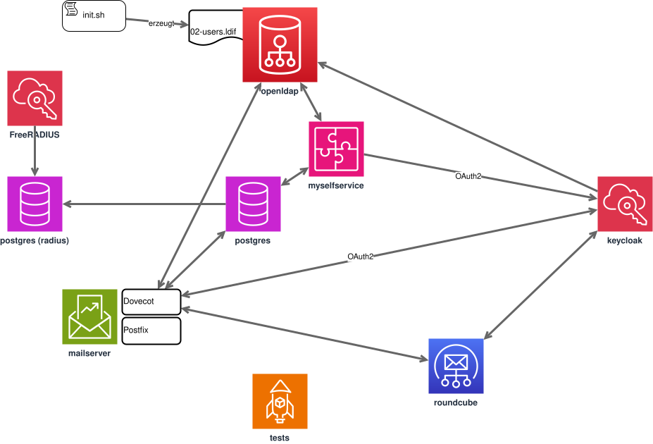

# Email Authentication PoC

## Übersicht
Dieser Proof of Concept (PoC) demonstriert eine Authentifizierungslösung für E-Mail-Dienste, die sowohl OAuth2 für Webmail als auch gerätebasierte Authentifizierungen für native E-Mail-Clients (Thunderbird, etc.) unterstützt.

## Hauptfunktionen
- Webmail-Zugriff via OAuth2/OIDC
- Selfservice-Portal für Benutzer
 - Verwaltung von Geräte-spezifischen Passwörtern über Webinterface
- Automatische Deaktivierung der LDAP-Authentifizierung nach Einrichtung von Geräte-Passwörtern

## Komponenten
- OpenLDAP (Benutzerverwaltung)
- Keycloak (Identity Provider)
- PostgreSQL (Datenbank)
- Roundcube (Webmail-Client)
- Dovecot/Postfix (Mailserver)
- FreeRADIUS (für WLAN-Accounts)
- Django (Selfservice-Portal)



## Voraussetzungen
- Docker und Docker Compose
- OpenSSL (um die LDAP-Passwörter zu generieren)
- Bearbeitung der `/etc/hosts` Datei
- Browser auf dem Docker-Host-System

## Installation

### 1. Hosts-Einträge
Fügen Sie folgende Einträge in `/etc/hosts` hinzu:
```
127.0.0.1 myselfservice
127.0.0.1 keycloak
127.0.0.1 roundcube
```

### 2. Initialisierung
```bash
cd docker/dev
./init.sh
```

Das `init.sh` Script automatisiert die initiale Einrichtung:

- Erstellt eine `.env` Datei aus der `env.example`
- ruft ein Script `openldap/generate_bootstrap.sh` auf, um OpenLDAP vorzubereiten

### 3. Start des Systems und Nutzung
```bash
docker compose -f docker-compose.dev.yml up --build
```
1. Initialzustand:
    - Anmeldung an Webmail http://roundcube:8081 (SSO) und LDAP-Zugangsdaten (Username: testuser1@example.org, Passwort: testuser1)
    - Gültige Anmeldung an imap (localhost:143 STARTTLS) mit LDAP-Zugangsdaten
2. Wechsel zu Geräte-Passwörtern:
    1. Anmelden an Django-Webinterface (SSO (Username: testuser1@example.org, Passwort: testuser1)) -> Email-Konten -> Account generieren
    2. Anmeldung mit LDAP-Zugangsdaten an imap (localhost:143 STARTTLS) nicht mehr möglich
    3. Anmeldung nur noch mit generierten Zugangsdaten möglich

Dieser Testablauf wird beim Start von `docker compose -f docker-compose.dev.yml up --build` automatisch mit dem User `testuser2@example.org` im Container tests durchgeführt. 


## Neustart nach Konfigurationsänderungen
Bei Änderungen an der Konfiguration:
```bash
docker compose -f docker-compose.dev.yml down --volumes
docker compose -f docker-compose.dev.yml up --build
```

## Hinweis
Alle Docker Volumes müssen entfernt werden (`docker compose down --volumes`), wenn Konfigurationsänderungen vorgenommen wurden, da sich einige Services sonst nicht korrekt neu initialisieren.

## Lokale Tests (Unit/Component)

Neben den Docker-basierten End-to-End-Tests gibt es schnelle Unit-Tests, die **ohne Docker** direkt in einem lokalen venv laufen. Sie nutzen In-Memory-SQLite und mocken bzw. deaktivieren alle externen Dienste (LDAP, Keycloak, Captcha, Firewall) über das Settings-Modul [`config.settings_test`](myselfservice/config/settings_test.py). Damit funktionieren VS Code Test Explorer, Debugger und Copilot-Checkpoints direkt auf dem Quellcode.

Einmalige Einrichtung (Python-Version siehe [`myselfservice/.python-version`](myselfservice/.python-version)):
```bash
cd myselfservice
python -m venv venv
./venv/bin/pip install -r requirements-dev.txt
```

Tests ausführen:
```bash
cd myselfservice
./venv/bin/python -m pytest
# gleichwertig mit dem Django-Runner:
./venv/bin/python manage.py test --settings=config.settings_test
```

In VS Code werden die Tests über [`.vscode/settings.json`](.vscode/settings.json) automatisch erkannt (Interpreter = `myselfservice/venv`, pytest aktiviert). Test-Abhängigkeiten stehen in [`myselfservice/requirements-dev.txt`](myselfservice/requirements-dev.txt) und sind bewusst von der Produktions-`requirements.txt` getrennt – das Docker-Image bleibt unberührt.

## Continuous Integration

Bei jedem Push und Pull Request auf `main` läuft der Workflow [`.github/workflows/ci.yml`](.github/workflows/ci.yml) mit drei Jobs:

- **`deps-sync`**: Führt `pip-compile ./requirements.in` unter der in der CI hinterlegten Python-Version aus und schlägt fehl, wenn `myselfservice/requirements.txt` davon abweicht. So bleibt die kompilierte Requirements-Datei garantiert konsistent zur Quelle.
- **`unit`**: Führt die lokalen Unit-Tests (`pytest` mit `config.settings_test`, SQLite, gemockte Dienste) aus – schnelles Feedback ohne Docker.
- **`e2e`**: Baut den kompletten Dev-Stack (`./init.sh` + `docker compose -f docker-compose.dev.yml up --build`) und verwendet den Exit-Code des `tests`-Containers als Ergebnis. Das entspricht dem oben beschriebenen manuellen Testablauf, nur automatisiert.

### Abhängigkeits-Updates

[Dependabot](.github/dependabot.yml) erstellt wöchentlich Pull Requests für Python-Pakete (`requirements.txt` via pip-compile), das Docker-Basis-Image und die verwendeten GitHub Actions. Der `deps-sync`-Job prüft jeden dieser PRs automatisch mit.

### Python-Version anheben

Die verwendete Python-Version ist an genau drei Stellen definiert:

1. [`myselfservice/Dockerfile`](myselfservice/Dockerfile) – `FROM python:X.Y-slim`
2. [`.github/workflows/ci.yml`](.github/workflows/ci.yml) – `env.PYTHON_VERSION`
3. [`myselfservice/.python-version`](myselfservice/.python-version) – lokales venv (Unit-Tests)

Zum Wechsel auf eine neuere Version (z. B. wenn die aktuelle aus dem Support fällt): alle drei Werte auf die neue Version setzen, das lokale venv neu anlegen, lokal einmal `pip-compile ./requirements.in` in `myselfservice/` ausführen und die aktualisierte `requirements.txt` committen. Ist die CI grün, ist die neue Version verifiziert.
